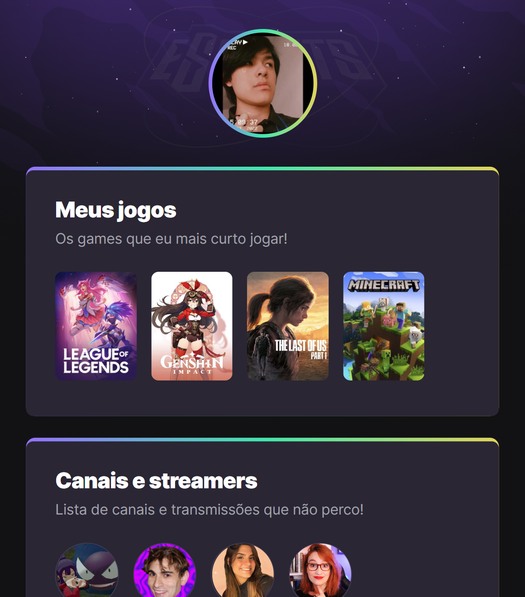

# NLW esports - Trilha Explorer

Projeto construído do evento Next Level Week da Rocketseat.

[Clique aqui para acessar](https://fujiihiroshi.github.io/nlw-esports-explorer)

## 🖥️ Tecnologias
- HTML
- CSS
- Git e Github

## 👨‍🏫 Educador
- [**Mayk Brito**](https://github.com/maykbrito)

## ❓ O que eu aprendi?
- HTML
  - Hypertext
  - Markup
  - Sintaxe de tag
  - Atributos
  - Comentários
- CSS
  - Declaration
  - Cascading
  - Comentários
  - Specifity
  - Box model
- Github
  - Primeiros passos de Git
- Figma

## 📞 Contato
guilhermefujii643@gmail.com

Oii, tudo bem?
